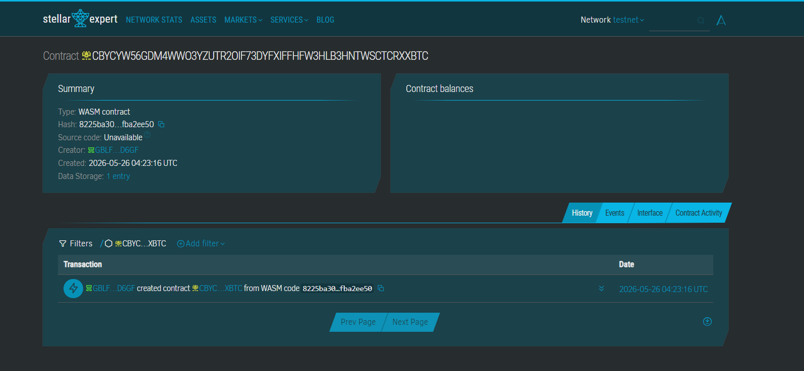

README.md
Markdown
# PassPorta FastTrack

A decentralized identity verification and automated payment clearance engine built on Soroban to optimize international passport processing and digital visa issuance pipelines.

## Problem & Solution
Legacy international travel administration processes are bogged down by multi-week processing delays, heavy document shipping expenses, and manual document validation pipelines. 

**PassPorta FastTrack** solves this by creating a secure cryptographic workflow framework. Travelers lock document data metadata proofs alongside required application processing fees directly onto a public Soroban state engine. The moment an authorized embassy office applies a signature confirmation layer, funds disburse directly to state treasuries, instantly generating verifiable travel authorization records.

## Timeline & Architecture
- **Phase 1:** Core Secure Escrow & Validation Contract State (Current MVP)
- **Phase 2:** W3C Verifiable Credentials structure alignment
- **Phase 3:** Automated push notification dashboards optimized for consular officers

## Stellar Features Used
- **Soroban Smart Contracts:** Secure and objective verification engine governing travel credentials.
- **Low Gas Fees:** Drastically undercuts high transactional legacy courier fees.
- **Instant Settlement:** Mitigates clearing delays between domestic sovereign financial networks.

## Prerequisites
- Rust `v1.75.0` or higher
- Target architecture: `wasm32-unknown-unknown`
- Soroban CLI `v20.0.0` Installed

## Developer Instructions

### CONTRACT ID
 Contract ID: CBYCYW56GDM4WWO3YZUTR2OIF73DYFXIFFHFW3HLB3HNTWSCTCRXXBTC
 
### 1. Build the Contract
Compile down to production-optimized WebAssembly binaries:
```bash
soroban contract build
2. Run Test Assertions
Execute the full suite of unit test conditions and validation parameters:

Bash
cargo test
3. Deploy to Testnet
Deploy your WASM binary to Stellar's Testnet sandbox infrastructure:

Bash
soroban contract deploy \
  --wasm target/wasm32-unknown-unknown/release/passporta_fasttrack.wasm \
  --source-account my-testnet-secret-key \
  --network testnet
4. Sample CLI Execution
Invoke contract actions using command arguments directly inside the console:

Bash
soroban contract invoke \
  --id CDDAECCCCCCCCCCCCCCCCCCCCCCCCCCCCCCCCCCCCCCCCCCCCCCCCCCCCCCC \
  --source-account my-testnet-secret-key \
  --network testnet \
  -- \
  submit_application \
  --traveler G...TRAVELER \
  --embassy G...EMBASSY \
  --token C...EUR_STABLE \
  --fee_amount 2000000000 \
  --document_hash 1111111111111111111111111111111111111111111111111111111111111111
License
Distributed under the MIT License. See LICENSE for details.
